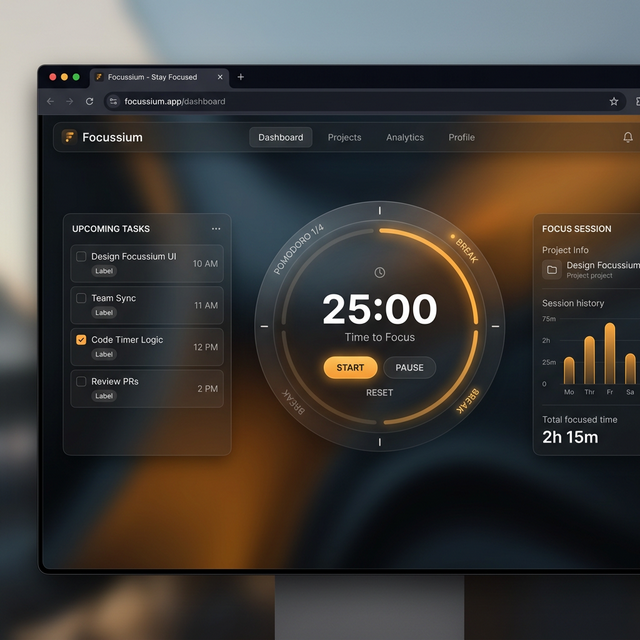
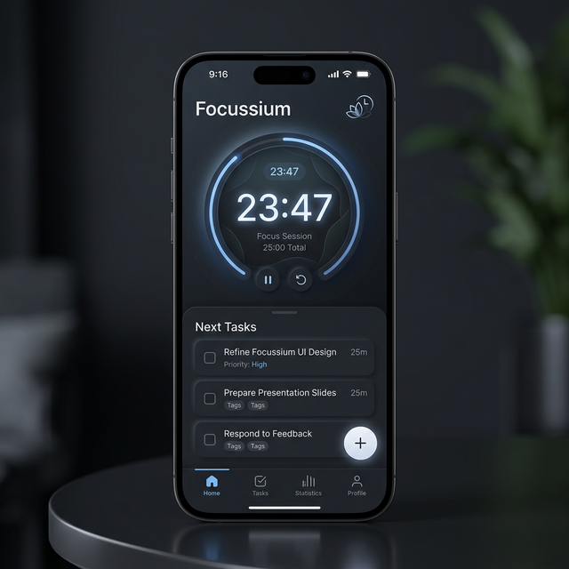

# 🧘 Focussium

Your zen productivity sanctuary—a minimalist yet powerful space designed to help you clear the mental clutter.

## 📱 Install Now

### Quick Install (Easiest Way!)
Just click the link below to open Focussium:
👉 **[OPEN FOCUSSIUM](https://sanjay3226.github.io/Focussium/)** 👈

Then click the **⋯ (three dots)** button in your browser and select **"Install app"** or **"Add to Home Screen"**

That's it! You now have Focussium on your phone/computer.

---

## ✨ Features

✅ **Minimalist Design** - Clean, distraction-free interface  
✅ **Works Offline** - Use it anywhere, anytime  
✅ **Lightning Fast** - Instant loading, zero lag  
✅ **Mobile & Desktop** - Works perfectly on all devices  
✅ **Install as App** - Runs like a native app  
✅ **Focus Mode** - Everything you need to stay productive

---

## 🎯 How to Use

1. **Open Focussium** - Visit the link above
2. **Install as App** - Click ⋯ → Install app
3. **Start Focusing** - Use it to clear your mind and boost productivity
4. **Enjoy** - Simple, clean, zen ✨

---

## 📸 Screenshots

**Desktop Version:**

**Mobile Version:**

---

## 🛠️ Built With

- HTML5
- CSS3
- JavaScript
- Progressive Web App (PWA)

---

## 📝 License

This project is open source and available for everyone to use.

---

## 💡 About

Focussium is designed for anyone who wants to:
- Reduce mental clutter
- Stay focused and productive
- Have a simple, beautiful tool
- Work without distractions

Made with ❤️ by [@sanjay3226](https://github.com/sanjay3226)

---

**Ready to focus? [Install Focussium now!](https://sanjay3226.github.io/Focussium/)**