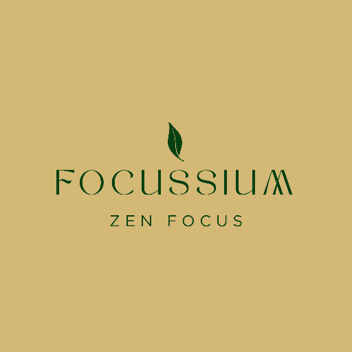

<div align="center">



# Focussium

**Your zen productivity space — beautifully built.**

[](https://sanjay3226.github.io/Focussium/)
[](https://sanjay3226.github.io/Focussium/)
[](https://github.com/sanjay3226/Focussium)
[](https://firebase.google.com/)
[](LICENSE)

[**→ Open App**](https://sanjay3226.github.io/Focussium/) · [Report Bug](https://github.com/sanjay3226/Focussium/issues) · [Request Feature](https://github.com/sanjay3226/Focussium/issues)

</div>

---

## ✨ What is Focussium?

Focussium is a **premium-grade productivity PWA** crafted for people who want a distraction-free, beautiful, and functional space to:

- ⏱ **Focus deeply** with a Pomodoro timer + ambient soundscapes
- ✅ **Manage tasks** with drag-and-drop ordering and list organisation
- 🧠 **Brain dump** freely without judgment
- 📊 **Track your vibe** with weekly and monthly productivity reports
- 🌙 **Work offline** — everything syncs when you're back online

No bloated frameworks. No subscriptions. Just a fast, gorgeous web app that installs like a native app.

---

## 🚀 Install in 10 seconds

1. **Open** → [sanjay3226.github.io/Focussium](https://sanjay3226.github.io/Focussium/)
2. **Tap** the browser menu `⋯`
3. **Select** "Add to Home Screen" or "Install App"

That's it — Focussium lives on your phone or desktop, offline-ready.

---

## 🎯 Features

| Feature | Description |
|---|---|
| ⏱ **Pomodoro Timer** | Focus / Short Break / Long Break modes with animated ring timer |
| 🎵 **Ambient Soundscapes** | Rain, Ocean Waves, Binaural Beats, Brown Noise — synthesised in-browser |
| 🌿 **Zen Fullscreen Mode** | Immersive focus overlay with aurora background, Escape to exit |
| ✅ **Task Management** | Create lists, drag-and-drop reorder, mark complete, archive |
| 🧠 **Brain Dump** | Freeform thought capture with auto-tagging |
| 📅 **Weekly Vibe Report** | Productivity score, heatmap, animated line charts, day drill-down |
| 📆 **Monthly Overview** | Calendar heatmap, streak tracking, monthly stats |
| 🤖 **AI Insights** | Auto-generated productivity insights from your weekly data |
| 🎨 **Themes & Accents** | Dark/Light themes + 8 accent colour palettes |
| 🔥 **Firebase Sync** | Optional Google auth with real-time Firestore cloud sync |
| 📥 **Report Export** | Download weekly report as a formatted PDF |
| 📴 **Offline First** | Service worker caches all assets — works without internet |
| 📱 **PWA Ready** | Installable, standalone, home screen icon, no browser chrome |

---

## 🛠 Tech Stack

| Layer | Technology |
|---|---|
| **Structure** | HTML5 (Semantic, ARIA-labelled) |
| **Styling** | Vanilla CSS3 (CSS variables, glassmorphism, animations) |
| **Logic** | Vanilla JavaScript (ES2022, module-pattern objects) |
| **Audio** | Web Audio API (FM synthesis, brown noise, binaural beats) |
| **Graphics** | SVG (custom animated charts, ring timer) |
| **Storage** | localStorage (local-first) + Firebase Firestore (cloud sync) |
| **Auth** | Firebase Authentication (Google OAuth) |
| **Offline** | Service Worker (cache-first + stale-while-revalidate) |
| **Deploy** | GitHub Pages |
| **Icons** | Custom inline SVG icon system (`js/icons.js`) |

---

## 📁 Project Structure

```
Focussium/
├── index.html              # Full app shell & all page markup
├── manifest.json           # PWA manifest (icons, shortcuts, display)
├── sw.js                   # Service worker (caching strategy)
├── icon-192.png            # App icon — standard
├── icon-512.png            # App icon — high-res / maskable
├── css/
│   └── styles.css          # Complete design system (tokens, components, pages)
└── js/
    ├── app.js              # Core app logic (State, Auth, Tasks, Pomo, Report, Settings)
    ├── sounds.js           # Web Audio API synthesiser & ambient engine
    ├── icons.js            # Inline SVG icon library
    └── firebase-config.js  # Firebase init & Firestore persistence
```

---

## 🏗 Architecture

Focussium uses a **single-bundle module-object pattern** — no bundler, no build step, no framework:

```
State          ← Single source of truth (tasks, pomo state, settings, xp)
  │
  ├── Storage  ← localStorage read/write + Firestore debounced sync
  ├── Auth     ← Firebase Google sign-in / sign-out
  ├── Tasks    ← CRUD + drag-and-drop + list management
  ├── Dump     ← Brain dump with smart auto-tagging
  ├── Pomo     ← Pomodoro timer state machine + ambient audio
  ├── Report   ← Weekly/monthly analytics, chart rendering, PDF export
  ├── Level    ← XP system, level-up detection, rewards
  ├── Settings ← Theme, accent, sound palette, session config
  └── Nav      ← Page routing + transition animations
```

---

## 🎨 Design System

All colours and spacing use **CSS custom properties**:

```css
/* Accent colour system (8 palettes) */
--ac         /* Accent colour */
--acr        /* Accent RGB triplet for rgba() */
--acg        /* Accent glow (shadow) colour */
--acgr       /* Accent gradient */
--acs        /* Accent soft (muted tint) */
--acl        /* Accent light (lighter variant) */

/* Surface layers */
--bg0 → --bg4   /* Background depth layers */
--tx1 → --tx3   /* Text contrast levels */
--bd            /* Border colour */
--bds           /* Border subtle */
```

---

## 🔧 Local Development

No build tools needed:

```bash
# Clone the repo
git clone https://github.com/sanjay3226/Focussium.git
cd Focussium

# Serve locally (any static server)
python -m http.server 8080
# OR
npx serve .

# Open in browser
open http://localhost:8080
```

> ⚠️ Firebase features require a valid `firebase-config.js`. For local-only use, the app works fully offline with localStorage.

---

## 🔒 Security Notes

- Firebase client config is intentionally public (standard for client-side auth)
- All user data is scoped to their authenticated Firebase UID in Firestore
- Firestore security rules should restrict read/write to `request.auth.uid == userId`
- No sensitive keys or secrets are stored in this repository

---

## 🗺 Roadmap

- [ ] Custom avatar upload on level milestone
- [ ] Simplified weekly vibe expandable view
- [ ] Dynamic daily quotes & insights (external API)
- [ ] Drag-and-drop task reordering
- [ ] Report download with premium layout
- [ ] Habit tracker integration
- [ ] Dark/light auto-switch based on time

---

## 📄 License

MIT © [sanjay3226](https://github.com/sanjay3226) — Free to use, fork, and build on.

---

<div align="center">

**Built with ❤️, vanilla JS, and way too much attention to animations.**

[⭐ Star this repo](https://github.com/sanjay3226/Focussium) · [🚀 Open App](https://sanjay3226.github.io/Focussium/)

</div>