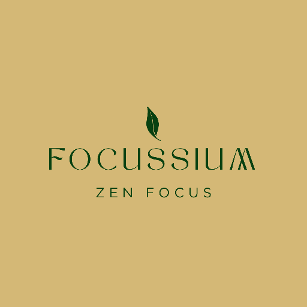
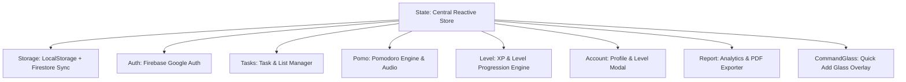

<div align="center">



# 🧘✨ Focussium v2.0 — Zen Space

**Your premium, distraction-free productivity sanctuary for deep work.**

[](https://sanjay3226.github.io/Focussium/)
[](https://sanjay3226.github.io/Focussium/)
[](https://github.com/sanjay3226/Focussium)
[](https://firebase.google.com/)
[](LICENSE)

[**→ Launch Live App**](https://sanjay3226.github.io/Focussium/) · [Report Issue](https://github.com/sanjay3226/Focussium/issues) · [Request Feature](https://github.com/sanjay3226/Focussium/issues)

</div>

---

## 🌟 What is Focussium?

**Focussium** is an Apple-grade, high-contrast, offline-first productivity PWA built for creators, engineers, and thinkers who need an immersive space to flow.

Designed with **zero build frameworks**, Focussium combines a **3D WebGL space nebula**, **custom Web Audio FM synthesizer**, **Pomodoro focus engine**, **task manager**, **brain dump capture**, and **pure Level & XP progression**.

---

## 🎯 Core Feature Breakdown

| Feature | Description |
|---|---|
| ⏱️ **Pomodoro Focus Engine** | Animated ring timer with Focus, Short Break, and Long Break presets + custom duration controls |
| 🧘 **In-App Fullscreen Zen Mode** | Immersive fixed overlay focus space with ambient aurora and zero OS window forcing |
| 🌌 **3D Space Nebula Background** | Dynamic Three.js WebGL space scene with interactive click-burst particle dust engine |
| 🏆 **Level & XP Engine** | Pure Level + XP progression (`(Focus Mins × 2) + (Tasks Done × 5)`). No cluttered rewards or achievement noise |
| ⚡ **Command Glass (Ctrl+K)** | Instant quick-add modal from anywhere in the app to create tasks or record brain dumps |
| 📋 **Task Management** | Multi-list organization, drag-and-drop reordering, priority tags, repeat rules, and step breakdowns |
| 🧠 **Brain Dump Workspace** | Freeform thought capture with auto-tagging and instant convert-to-task functionality |
| 📊 **Vibe Analytics & Reports** | Weekly/monthly productivity heatmaps, streak tracking, interactive charts, and high-fidelity PDF exports |
| 🎵 **Web Audio FM Synthesizer** | In-browser synthesized ambient soundscapes (Rain, Ocean, Binaural Beats, Brown Noise) — 0 MB audio downloads |
| 🔒 **1-Click Google Cloud Sync** | Seamless Firebase Authentication with automated debounced Firestore cloud synchronization |
| 📱 **Installable PWA** | Service Worker offline caching (`stale-while-revalidate`) — works 100% offline |

---

## ⌨️ Keyboard Shortcuts

| Shortcut | Action |
|---|---|
| <kbd>Ctrl</kbd> + <kbd>K</kbd> / <kbd>Cmd</kbd> + <kbd>K</kbd> | Open / Close **Command Glass** Quick Add |
| <kbd>Escape</kbd> | Close active modal / Exit Fullscreen Focus mode |
| <kbd>Enter</kbd> | Submit task title, brain dump, or list creation |

---

## 🏗️ Architecture & Design Pattern

Focussium utilizes a clean, **modular object-literal architecture** with local-first state persistence:


```mermaid
graph TD
    State[State: Central Reactive Store] --> Storage[Storage: LocalStorage + Firestore Sync]
    State --> Auth[Auth: Firebase Google Auth]
    State --> Tasks[Tasks: Task & List Manager]
    State --> Pomo[Pomo: Pomodoro Engine & Audio]
    State --> Level[Level: XP & Level Progression Engine]
    State --> Account[Account: Profile & Level Modal]
    State --> Report[Report: Analytics & PDF Exporter]
    State --> CommandGlass[CommandGlass: Quick Add Glass Overlay]
```

---

## 🛠️ Technology Stack

- **Core**: HTML5, Vanilla JavaScript (ES2022+), CSS3 Variables & Glassmorphism
- **3D Graphics**: Three.js (r128) WebGL Particle Nebula Engine
- **Audio Engine**: Web Audio API (FM Oscillator Synthesis & Brown Noise Buffer Generators)
- **Backend & Cloud Sync**: Firebase Authentication (Google OAuth 2.0) & Firestore NoSQL Database
- **Offline / PWA**: Service Worker Cache API (`stale-while-revalidate` & offline fallback strategy)

---

## 🚀 Quickstart & Local Setup

No `npm install`, Node.js modules, or complex build pipelines required:

```bash
# 1. Clone the repository
git clone https://github.com/sanjay3226/Focussium.git
cd Focussium

# 2. Serve static files locally (any HTTP server)
npx serve .
# OR
python -m http.server 8080

# 3. Open in browser
# Navigate to http://localhost:8080
```

---

## 📄 License

Distributed under the **MIT License**. See `LICENSE` for details.

---

<div align="center">

**Built with ❤️ for deep focus and flow.**

[⭐ Star Repository](https://github.com/sanjay3226/Focussium) · [🚀 Launch Focussium App](https://sanjay3226.github.io/Focussium/)

</div>